# StockPro UML Diagrams

This document covers the whole project and includes each microservice in a separate, readable UML section.

## 1. System Architecture Diagram

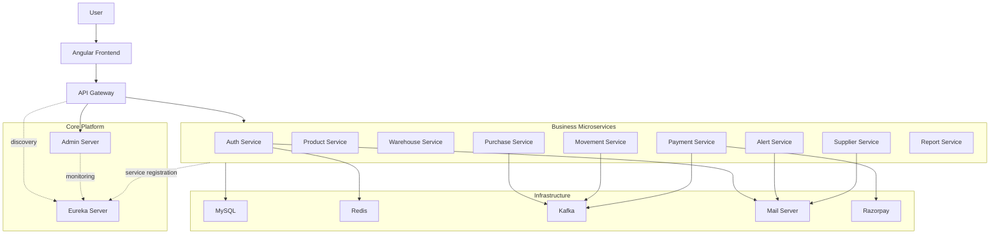
```mermaid
flowchart TD
    User["User"]
    Frontend["Angular Frontend"]
    Gateway["API Gateway"]

    subgraph Core["Core Platform"]
        Eureka["Eureka Server"]
        Admin["Admin Server"]
    end

    subgraph Services["Business Microservices"]
        Auth["Auth Service"]
        Product["Product Service"]
        Warehouse["Warehouse Service"]
        Purchase["Purchase Service"]
        Payment["Payment Service"]
        Supplier["Supplier Service"]
        Movement["Movement Service"]
        Alert["Alert Service"]
        Report["Report Service"]
    end

    subgraph Infra["Infrastructure"]
        MySQL["MySQL"]
        Redis["Redis"]
        Kafka["Kafka"]
        Mail["Mail Server"]
        Razorpay["Razorpay"]
    end

    User --> Frontend --> Gateway
    Gateway --> Services
    Gateway --> Admin

    Services -. service registration .-> Eureka
    Gateway -. discovery .-> Eureka
    Admin -. monitoring .-> Eureka

    Services --> MySQL
    Auth --> Redis
    Auth --> Mail
    Alert --> Mail
    Supplier --> Mail
    Purchase --> Kafka
    Movement --> Kafka
    Payment --> Kafka
    Payment --> Razorpay
```

## 2. Microservice Communication Diagram

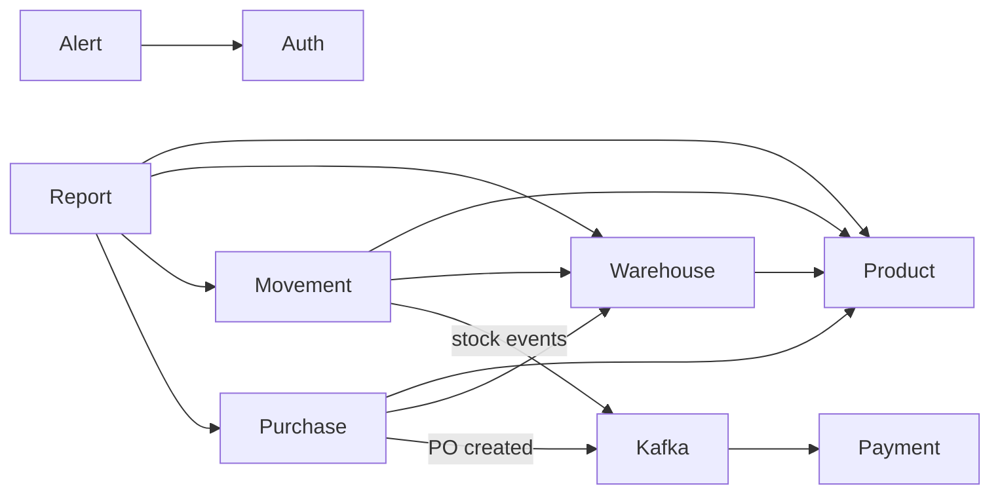
```mermaid
flowchart LR
    Purchase["Purchase"]
    Product["Product"]
    Warehouse["Warehouse"]
    Movement["Movement"]
    Alert["Alert"]
    Auth["Auth"]
    Report["Report"]
    Payment["Payment"]
    Kafka["Kafka"]

    Purchase --> Product
    Purchase --> Warehouse
    Warehouse --> Product
    Movement --> Product
    Movement --> Warehouse
    Alert --> Auth
    Report --> Product
    Report --> Warehouse
    Report --> Movement
    Report --> Purchase

    Purchase -- "PO created" --> Kafka
    Kafka --> Payment
    Movement -- "stock events" --> Kafka
```

## 3. Auth Service

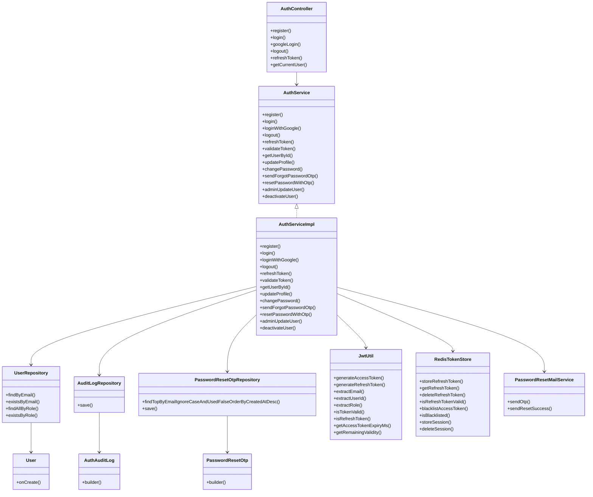
```mermaid
classDiagram
    class AuthController {
        +register()
        +login()
        +googleLogin()
        +logout()
        +refreshToken()
        +getCurrentUser()
    }
    class AuthService {
        +register()
        +login()
        +loginWithGoogle()
        +logout()
        +refreshToken()
        +validateToken()
        +getUserById()
        +updateProfile()
        +changePassword()
        +sendForgotPasswordOtp()
        +resetPasswordWithOtp()
        +adminUpdateUser()
        +deactivateUser()
    }
    class AuthServiceImpl {
        +register()
        +login()
        +loginWithGoogle()
        +logout()
        +refreshToken()
        +validateToken()
        +getUserById()
        +updateProfile()
        +changePassword()
        +sendForgotPasswordOtp()
        +resetPasswordWithOtp()
        +adminUpdateUser()
        +deactivateUser()
    }
    class UserRepository {
        +findByEmail()
        +existsByEmail()
        +findAllByRole()
        +existsByRole()
    }
    class AuditLogRepository {
        +save()
    }
    class PasswordResetOtpRepository {
        +findTopByEmailIgnoreCaseAndUsedFalseOrderByCreatedAtDesc()
        +save()
    }
    class JwtUtil {
        +generateAccessToken()
        +generateRefreshToken()
        +extractEmail()
        +extractUserId()
        +extractRole()
        +isTokenValid()
        +isRefreshToken()
        +getAccessTokenExpiryMs()
        +getRemainingValidity()
    }
    class RedisTokenStore {
        +storeRefreshToken()
        +getRefreshToken()
        +deleteRefreshToken()
        +isRefreshTokenValid()
        +blacklistAccessToken()
        +isBlacklisted()
        +storeSession()
        +deleteSession()
    }
    class PasswordResetMailService {
        +sendOtp()
        +sendResetSuccess()
    }
    class User {
        +onCreate()
    }
    class AuthAuditLog {
        +builder()
    }
    class PasswordResetOtp {
        +builder()
    }

    AuthController --> AuthService
    AuthService <|.. AuthServiceImpl
    AuthServiceImpl --> UserRepository
    AuthServiceImpl --> AuditLogRepository
    AuthServiceImpl --> PasswordResetOtpRepository
    AuthServiceImpl --> JwtUtil
    AuthServiceImpl --> RedisTokenStore
    AuthServiceImpl --> PasswordResetMailService
    UserRepository --> User
    AuditLogRepository --> AuthAuditLog
    PasswordResetOtpRepository --> PasswordResetOtp
```

## 4. Product Service

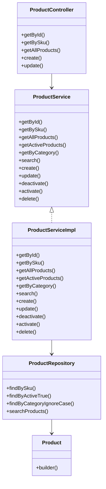
```mermaid
classDiagram
    class ProductController {
        +getById()
        +getBySku()
        +getAllProducts()
        +create()
        +update()
    }
    class ProductService {
        +getById()
        +getBySku()
        +getAllProducts()
        +getActiveProducts()
        +getByCategory()
        +search()
        +create()
        +update()
        +deactivate()
        +activate()
        +delete()
    }
    class ProductServiceImpl {
        +getById()
        +getBySku()
        +getAllProducts()
        +getActiveProducts()
        +getByCategory()
        +search()
        +create()
        +update()
        +deactivate()
        +activate()
        +delete()
    }
    class ProductRepository {
        +findBySku()
        +findByActiveTrue()
        +findByCategoryIgnoreCase()
        +searchProducts()
    }
    class Product {
        +builder()
    }

    ProductController --> ProductService
    ProductService <|.. ProductServiceImpl
    ProductServiceImpl --> ProductRepository
    ProductRepository --> Product
```

## 5. Warehouse Service

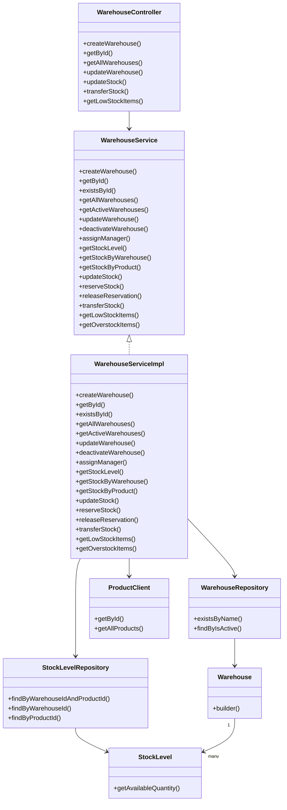
```mermaid
classDiagram
    class WarehouseController {
        +createWarehouse()
        +getById()
        +getAllWarehouses()
        +updateWarehouse()
        +updateStock()
        +transferStock()
        +getLowStockItems()
    }
    class WarehouseService {
        +createWarehouse()
        +getById()
        +existsById()
        +getAllWarehouses()
        +getActiveWarehouses()
        +updateWarehouse()
        +deactivateWarehouse()
        +assignManager()
        +getStockLevel()
        +getStockByWarehouse()
        +getStockByProduct()
        +updateStock()
        +reserveStock()
        +releaseReservation()
        +transferStock()
        +getLowStockItems()
        +getOverstockItems()
    }
    class WarehouseServiceImpl {
        +createWarehouse()
        +getById()
        +existsById()
        +getAllWarehouses()
        +getActiveWarehouses()
        +updateWarehouse()
        +deactivateWarehouse()
        +assignManager()
        +getStockLevel()
        +getStockByWarehouse()
        +getStockByProduct()
        +updateStock()
        +reserveStock()
        +releaseReservation()
        +transferStock()
        +getLowStockItems()
        +getOverstockItems()
    }
    class WarehouseRepository {
        +existsByName()
        +findByIsActive()
    }
    class StockLevelRepository {
        +findByWarehouseIdAndProductId()
        +findByWarehouseId()
        +findByProductId()
    }
    class ProductClient {
        +getById()
        +getAllProducts()
    }
    class Warehouse {
        +builder()
    }
    class StockLevel {
        +getAvailableQuantity()
    }

    WarehouseController --> WarehouseService
    WarehouseService <|.. WarehouseServiceImpl
    WarehouseServiceImpl --> WarehouseRepository
    WarehouseServiceImpl --> StockLevelRepository
    WarehouseServiceImpl --> ProductClient
    WarehouseRepository --> Warehouse
    StockLevelRepository --> StockLevel
    Warehouse "1" --> "many" StockLevel
```

## 6. Purchase Service

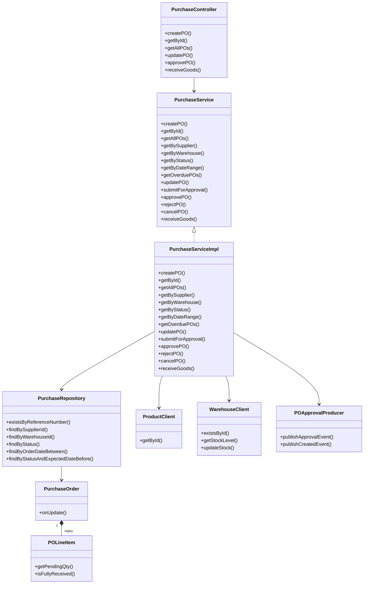
```mermaid
classDiagram
    class PurchaseController {
        +createPO()
        +getById()
        +getAllPOs()
        +updatePO()
        +approvePO()
        +receiveGoods()
    }
    class PurchaseService {
        +createPO()
        +getById()
        +getAllPOs()
        +getBySupplier()
        +getByWarehouse()
        +getByStatus()
        +getByDateRange()
        +getOverduePOs()
        +updatePO()
        +submitForApproval()
        +approvePO()
        +rejectPO()
        +cancelPO()
        +receiveGoods()
    }
    class PurchaseServiceImpl {
        +createPO()
        +getById()
        +getAllPOs()
        +getBySupplier()
        +getByWarehouse()
        +getByStatus()
        +getByDateRange()
        +getOverduePOs()
        +updatePO()
        +submitForApproval()
        +approvePO()
        +rejectPO()
        +cancelPO()
        +receiveGoods()
    }
    class PurchaseRepository {
        +existsByReferenceNumber()
        +findBySupplierId()
        +findByWarehouseId()
        +findByStatus()
        +findByOrderDateBetween()
        +findByStatusAndExpectedDateBefore()
    }
    class ProductClient {
        +getById()
    }
    class WarehouseClient {
        +existsById()
        +getStockLevel()
        +updateStock()
    }
    class POApprovalProducer {
        +publishApprovalEvent()
        +publishCreatedEvent()
    }
    class PurchaseOrder {
        +onUpdate()
    }
    class POLineItem {
        +getPendingQty()
        +isFullyReceived()
    }

    PurchaseController --> PurchaseService
    PurchaseService <|.. PurchaseServiceImpl
    PurchaseServiceImpl --> PurchaseRepository
    PurchaseServiceImpl --> ProductClient
    PurchaseServiceImpl --> WarehouseClient
    PurchaseServiceImpl --> POApprovalProducer
    PurchaseRepository --> PurchaseOrder
    PurchaseOrder "1" *-- "many" POLineItem
```

## 7. Payment Service

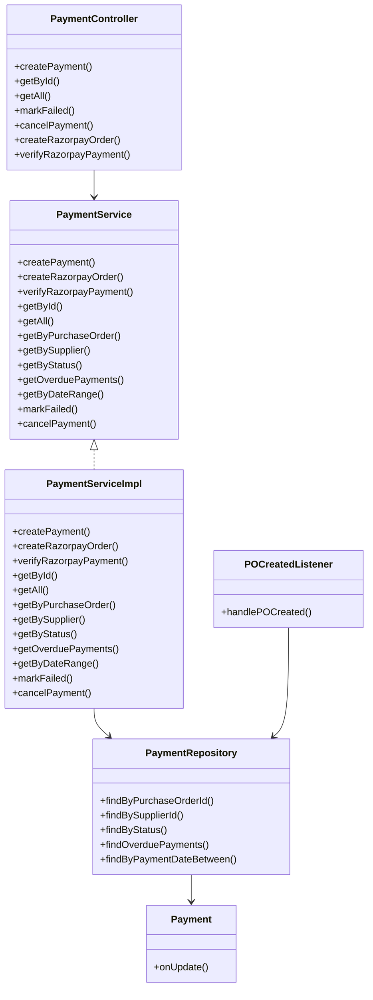
```mermaid
classDiagram
    class PaymentController {
        +createPayment()
        +getById()
        +getAll()
        +markFailed()
        +cancelPayment()
        +createRazorpayOrder()
        +verifyRazorpayPayment()
    }
    class PaymentService {
        +createPayment()
        +createRazorpayOrder()
        +verifyRazorpayPayment()
        +getById()
        +getAll()
        +getByPurchaseOrder()
        +getBySupplier()
        +getByStatus()
        +getOverduePayments()
        +getByDateRange()
        +markFailed()
        +cancelPayment()
    }
    class PaymentServiceImpl {
        +createPayment()
        +createRazorpayOrder()
        +verifyRazorpayPayment()
        +getById()
        +getAll()
        +getByPurchaseOrder()
        +getBySupplier()
        +getByStatus()
        +getOverduePayments()
        +getByDateRange()
        +markFailed()
        +cancelPayment()
    }
    class PaymentRepository {
        +findByPurchaseOrderId()
        +findBySupplierId()
        +findByStatus()
        +findOverduePayments()
        +findByPaymentDateBetween()
    }
    class POCreatedListener {
        +handlePOCreated()
    }
    class Payment {
        +onUpdate()
    }

    PaymentController --> PaymentService
    PaymentService <|.. PaymentServiceImpl
    PaymentServiceImpl --> PaymentRepository
    POCreatedListener --> PaymentRepository
    PaymentRepository --> Payment
```

## 8. Supplier Service

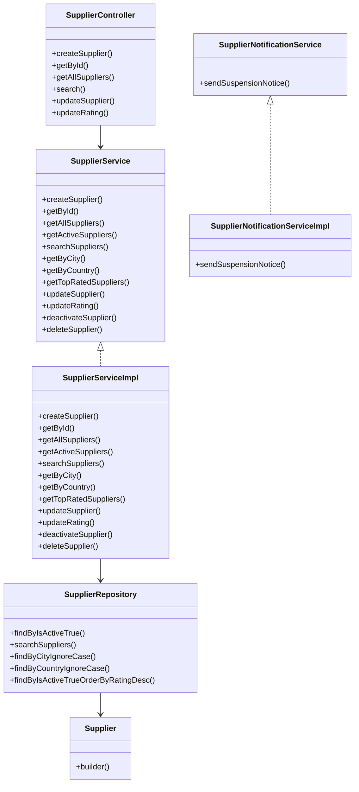
```mermaid
classDiagram
    class SupplierController {
        +createSupplier()
        +getById()
        +getAllSuppliers()
        +search()
        +updateSupplier()
        +updateRating()
    }
    class SupplierService {
        +createSupplier()
        +getById()
        +getAllSuppliers()
        +getActiveSuppliers()
        +searchSuppliers()
        +getByCity()
        +getByCountry()
        +getTopRatedSuppliers()
        +updateSupplier()
        +updateRating()
        +deactivateSupplier()
        +deleteSupplier()
    }
    class SupplierServiceImpl {
        +createSupplier()
        +getById()
        +getAllSuppliers()
        +getActiveSuppliers()
        +searchSuppliers()
        +getByCity()
        +getByCountry()
        +getTopRatedSuppliers()
        +updateSupplier()
        +updateRating()
        +deactivateSupplier()
        +deleteSupplier()
    }
    class SupplierNotificationService {
        +sendSuspensionNotice()
    }
    class SupplierNotificationServiceImpl {
        +sendSuspensionNotice()
    }
    class SupplierRepository {
        +findByIsActiveTrue()
        +searchSuppliers()
        +findByCityIgnoreCase()
        +findByCountryIgnoreCase()
        +findByIsActiveTrueOrderByRatingDesc()
    }
    class Supplier {
        +builder()
    }

    SupplierController --> SupplierService
    SupplierService <|.. SupplierServiceImpl
    SupplierServiceImpl --> SupplierRepository
    SupplierNotificationService <|.. SupplierNotificationServiceImpl
    SupplierRepository --> Supplier
```

## 9. Movement Service

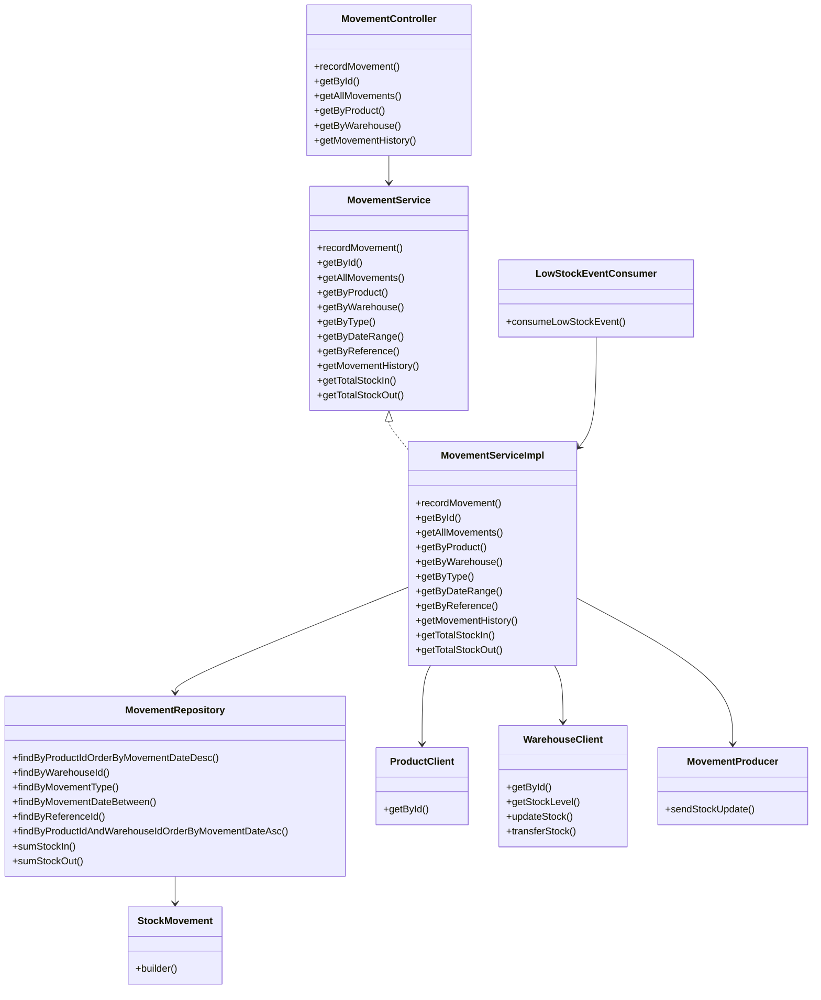
```mermaid
classDiagram
    class MovementController {
        +recordMovement()
        +getById()
        +getAllMovements()
        +getByProduct()
        +getByWarehouse()
        +getMovementHistory()
    }
    class MovementService {
        +recordMovement()
        +getById()
        +getAllMovements()
        +getByProduct()
        +getByWarehouse()
        +getByType()
        +getByDateRange()
        +getByReference()
        +getMovementHistory()
        +getTotalStockIn()
        +getTotalStockOut()
    }
    class MovementServiceImpl {
        +recordMovement()
        +getById()
        +getAllMovements()
        +getByProduct()
        +getByWarehouse()
        +getByType()
        +getByDateRange()
        +getByReference()
        +getMovementHistory()
        +getTotalStockIn()
        +getTotalStockOut()
    }
    class MovementRepository {
        +findByProductIdOrderByMovementDateDesc()
        +findByWarehouseId()
        +findByMovementType()
        +findByMovementDateBetween()
        +findByReferenceId()
        +findByProductIdAndWarehouseIdOrderByMovementDateAsc()
        +sumStockIn()
        +sumStockOut()
    }
    class ProductClient {
        +getById()
    }
    class WarehouseClient {
        +getById()
        +getStockLevel()
        +updateStock()
        +transferStock()
    }
    class MovementProducer {
        +sendStockUpdate()
    }
    class LowStockEventConsumer {
        +consumeLowStockEvent()
    }
    class StockMovement {
        +builder()
    }

    MovementController --> MovementService
    MovementService <|.. MovementServiceImpl
    MovementServiceImpl --> MovementRepository
    MovementServiceImpl --> ProductClient
    MovementServiceImpl --> WarehouseClient
    MovementServiceImpl --> MovementProducer
    MovementRepository --> StockMovement
    LowStockEventConsumer --> MovementServiceImpl
```

## 10. Alert Service

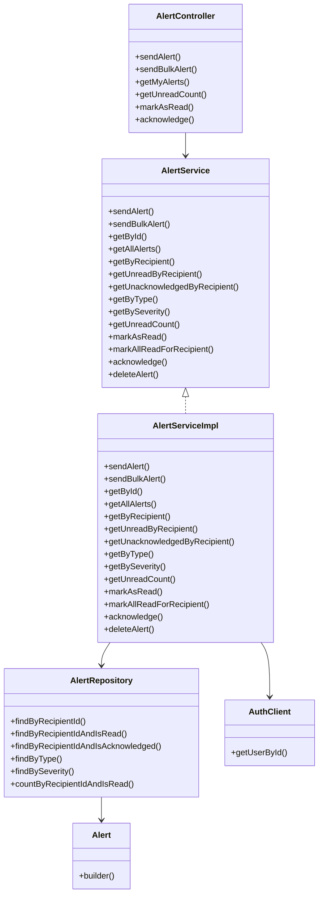
```mermaid
classDiagram
    class AlertController {
        +sendAlert()
        +sendBulkAlert()
        +getMyAlerts()
        +getUnreadCount()
        +markAsRead()
        +acknowledge()
    }
    class AlertService {
        +sendAlert()
        +sendBulkAlert()
        +getById()
        +getAllAlerts()
        +getByRecipient()
        +getUnreadByRecipient()
        +getUnacknowledgedByRecipient()
        +getByType()
        +getBySeverity()
        +getUnreadCount()
        +markAsRead()
        +markAllReadForRecipient()
        +acknowledge()
        +deleteAlert()
    }
    class AlertServiceImpl {
        +sendAlert()
        +sendBulkAlert()
        +getById()
        +getAllAlerts()
        +getByRecipient()
        +getUnreadByRecipient()
        +getUnacknowledgedByRecipient()
        +getByType()
        +getBySeverity()
        +getUnreadCount()
        +markAsRead()
        +markAllReadForRecipient()
        +acknowledge()
        +deleteAlert()
    }
    class AlertRepository {
        +findByRecipientId()
        +findByRecipientIdAndIsRead()
        +findByRecipientIdAndIsAcknowledged()
        +findByType()
        +findBySeverity()
        +countByRecipientIdAndIsRead()
    }
    class AuthClient {
        +getUserById()
    }
    class Alert {
        +builder()
    }

    AlertController --> AlertService
    AlertService <|.. AlertServiceImpl
    AlertServiceImpl --> AlertRepository
    AlertServiceImpl --> AuthClient
    AlertRepository --> Alert
```

## 11. Report Service

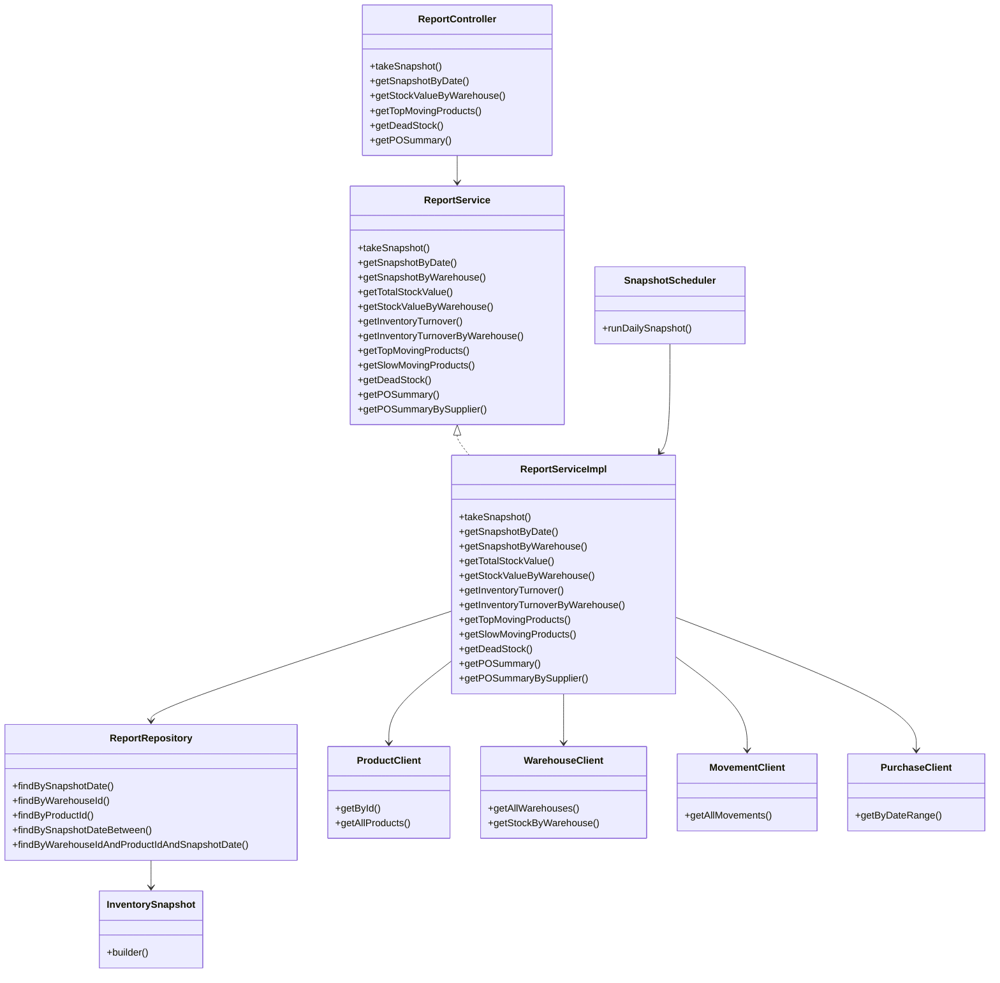
```mermaid
classDiagram
    class ReportController {
        +takeSnapshot()
        +getSnapshotByDate()
        +getStockValueByWarehouse()
        +getTopMovingProducts()
        +getDeadStock()
        +getPOSummary()
    }
    class ReportService {
        +takeSnapshot()
        +getSnapshotByDate()
        +getSnapshotByWarehouse()
        +getTotalStockValue()
        +getStockValueByWarehouse()
        +getInventoryTurnover()
        +getInventoryTurnoverByWarehouse()
        +getTopMovingProducts()
        +getSlowMovingProducts()
        +getDeadStock()
        +getPOSummary()
        +getPOSummaryBySupplier()
    }
    class ReportServiceImpl {
        +takeSnapshot()
        +getSnapshotByDate()
        +getSnapshotByWarehouse()
        +getTotalStockValue()
        +getStockValueByWarehouse()
        +getInventoryTurnover()
        +getInventoryTurnoverByWarehouse()
        +getTopMovingProducts()
        +getSlowMovingProducts()
        +getDeadStock()
        +getPOSummary()
        +getPOSummaryBySupplier()
    }
    class ReportRepository {
        +findBySnapshotDate()
        +findByWarehouseId()
        +findByProductId()
        +findBySnapshotDateBetween()
        +findByWarehouseIdAndProductIdAndSnapshotDate()
    }
    class ProductClient {
        +getById()
        +getAllProducts()
    }
    class WarehouseClient {
        +getAllWarehouses()
        +getStockByWarehouse()
    }
    class MovementClient {
        +getAllMovements()
    }
    class PurchaseClient {
        +getByDateRange()
    }
    class SnapshotScheduler {
        +runDailySnapshot()
    }
    class InventorySnapshot {
        +builder()
    }

    ReportController --> ReportService
    ReportService <|.. ReportServiceImpl
    ReportServiceImpl --> ReportRepository
    ReportServiceImpl --> ProductClient
    ReportServiceImpl --> WarehouseClient
    ReportServiceImpl --> MovementClient
    ReportServiceImpl --> PurchaseClient
    SnapshotScheduler --> ReportServiceImpl
    ReportRepository --> InventorySnapshot
```

## 12. API Gateway Architecture

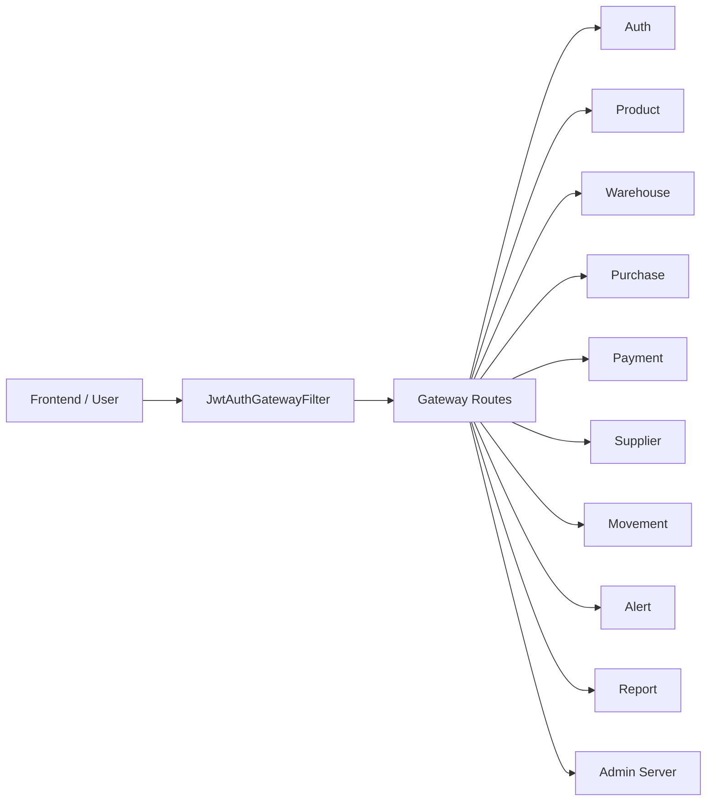
```mermaid
flowchart LR
    Client["Frontend / User"]
    JwtFilter["JwtAuthGatewayFilter"]
    Routes["Gateway Routes"]

    Auth["Auth"]
    Product["Product"]
    Warehouse["Warehouse"]
    Purchase["Purchase"]
    Payment["Payment"]
    Supplier["Supplier"]
    Movement["Movement"]
    Alert["Alert"]
    Report["Report"]
    Admin["Admin Server"]

    Client --> JwtFilter
    JwtFilter --> Routes
    Routes --> Auth
    Routes --> Product
    Routes --> Warehouse
    Routes --> Purchase
    Routes --> Payment
    Routes --> Supplier
    Routes --> Movement
    Routes --> Alert
    Routes --> Report
    Routes --> Admin
```

## 13. Core Domain Overview

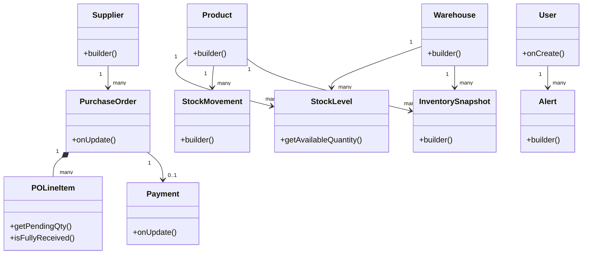
```mermaid
classDiagram
    class User {
        +onCreate()
    }
    class Product {
        +builder()
    }
    class Warehouse {
        +builder()
    }
    class StockLevel {
        +getAvailableQuantity()
    }
    class PurchaseOrder {
        +onUpdate()
    }
    class POLineItem {
        +getPendingQty()
        +isFullyReceived()
    }
    class Payment {
        +onUpdate()
    }
    class Supplier {
        +builder()
    }
    class StockMovement {
        +builder()
    }
    class Alert {
        +builder()
    }
    class InventorySnapshot {
        +builder()
    }

    Warehouse "1" --> "many" StockLevel
    Product "1" --> "many" StockLevel
    Supplier "1" --> "many" PurchaseOrder
    PurchaseOrder "1" *-- "many" POLineItem
    PurchaseOrder "1" --> "0..1" Payment
    Product "1" --> "many" StockMovement
    User "1" --> "many" Alert
    Product "1" --> "many" InventorySnapshot
    Warehouse "1" --> "many" InventorySnapshot
```

## 14. Actors and Functionality

### 14.1 Main Actors

| Actor | Description |
| --- | --- |
| `ADMIN` | Full system administrator who manages users, warehouses, and overall platform control |
| `INVENTORY_MANAGER` | Oversees products, stock health, approvals, alerts, and reports |
| `WAREHOUSE_STAFF` | Handles stock movements, warehouse transfers, and goods receipt operations |
| `PURCHASE_OFFICER` | Manages suppliers, creates purchase orders, and handles payment-related operations |
| `SYSTEM` | Internal/background system role used for automated flows and system-generated actions |
| `SUPPLIER` | External supplier role present in the domain model for vendor-related workflows |
| `USER` | End user interacting through the frontend and API gateway |

### 14.2 Actor Functionality Matrix

| Functionality | ADMIN | INVENTORY_MANAGER | WAREHOUSE_STAFF | PURCHASE_OFFICER |
| --- | --- | --- | --- | --- |
| Login / logout / profile management | Yes | Yes | Yes | Yes |
| Manage users | Yes | No | No | No |
| Create and manage products | Yes | Yes | No | No |
| Create and manage warehouses | Yes | No | No | No |
| View warehouse stock | Yes | Yes | Yes | Yes |
| Update warehouse stock | Yes | Yes | No | No |
| Reserve / release stock | Yes | Yes | No | Yes |
| Transfer stock between warehouses | Yes | Yes | Yes | No |
| Create purchase orders | Yes | No | No | Yes |
| Update / submit purchase orders | Yes | No | No | Yes |
| Approve / reject purchase orders | Yes | Yes | No | No |
| Receive goods for purchase orders | Yes | Yes | Yes | No |
| Manage suppliers | Yes | No | No | Yes |
| Update supplier ratings | Yes | Yes | No | Yes |
| Create and manage payments | Yes | Yes | No | Yes |
| Record stock movements | Yes | Yes | Yes | No |
| View alerts | Yes | Yes | Yes | Yes |
| Send or manage alerts globally | Yes | Yes | No | No |
| View reports and analytics | Yes | Yes | No | Partial |

### 14.3 Major Functional Modules

| Module | Main Functionality |
| --- | --- |
| `Auth Service` | authentication, JWT token handling, password reset, user management |
| `Product Service` | product catalog, SKU lookup, category search, activation/deactivation |
| `Warehouse Service` | warehouse setup, stock storage, reservation, release, transfer, stock thresholds |
| `Purchase Service` | purchase order lifecycle, approval flow, goods receipt |
| `Payment Service` | payment tracking, Razorpay order flow, payment verification |
| `Supplier Service` | supplier master data, rating, search, deactivation |
| `Movement Service` | stock in/out history, transfer logging, movement analytics |
| `Alert Service` | in-app alerts, bulk alerts, severity tracking, notification support |
| `Report Service` | stock valuation, snapshots, dead stock, top-moving products, PO summaries |
| `API Gateway` | single entry point, request routing, JWT filtering |
| `Frontend` | dashboards, role-based pages, user interaction |

## 15. Database / Entity Diagrams

### 15.1 Auth Database Entities

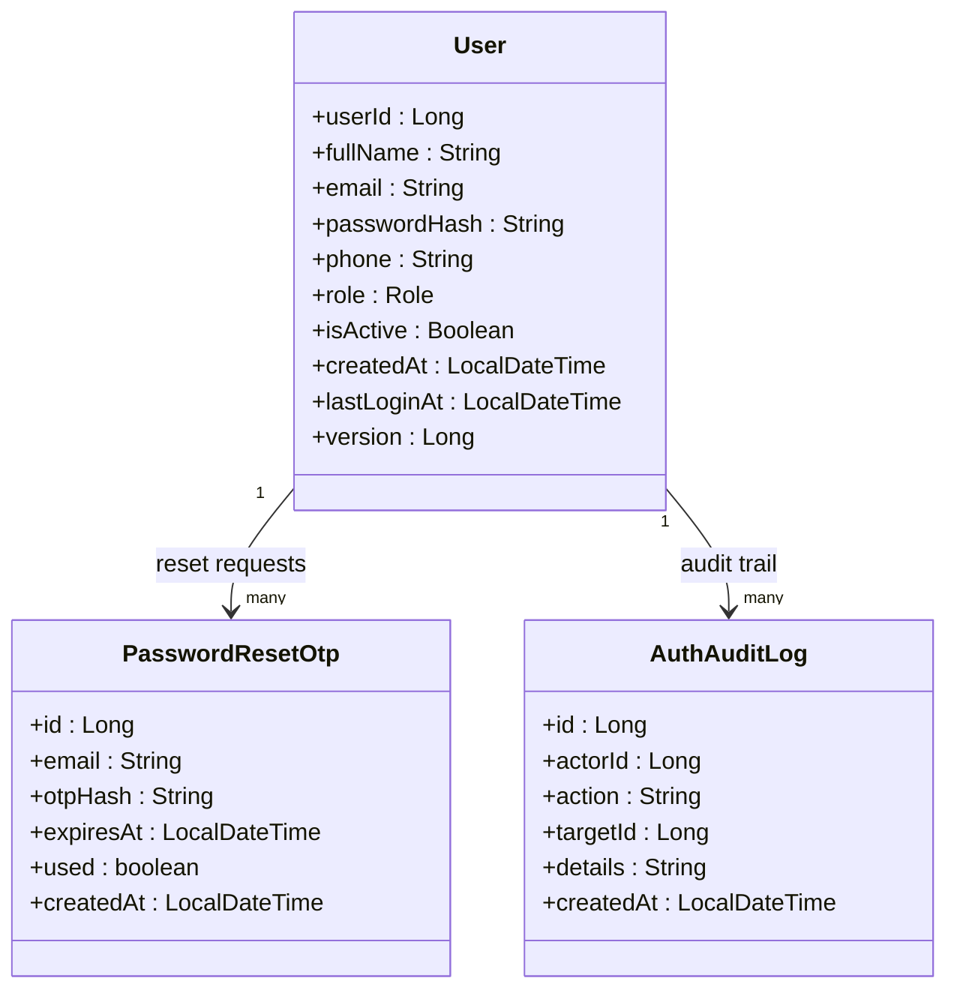
```mermaid
classDiagram
    class User {
        +userId : Long
        +fullName : String
        +email : String
        +passwordHash : String
        +phone : String
        +role : Role
        +isActive : Boolean
        +createdAt : LocalDateTime
        +lastLoginAt : LocalDateTime
        +version : Long
    }

    class PasswordResetOtp {
        +id : Long
        +email : String
        +otpHash : String
        +expiresAt : LocalDateTime
        +used : boolean
        +createdAt : LocalDateTime
    }

    class AuthAuditLog {
        +id : Long
        +actorId : Long
        +action : String
        +targetId : Long
        +details : String
        +createdAt : LocalDateTime
    }

    User "1" --> "many" PasswordResetOtp : reset requests
    User "1" --> "many" AuthAuditLog : audit trail
```

### 15.2 Inventory Database Entities

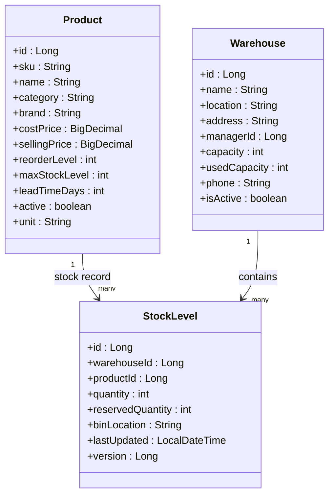
```mermaid
classDiagram
    class Product {
        +id : Long
        +sku : String
        +name : String
        +category : String
        +brand : String
        +costPrice : BigDecimal
        +sellingPrice : BigDecimal
        +reorderLevel : int
        +maxStockLevel : int
        +leadTimeDays : int
        +active : boolean
        +unit : String
    }

    class Warehouse {
        +id : Long
        +name : String
        +location : String
        +address : String
        +managerId : Long
        +capacity : int
        +usedCapacity : int
        +phone : String
        +isActive : boolean
    }

    class StockLevel {
        +id : Long
        +warehouseId : Long
        +productId : Long
        +quantity : int
        +reservedQuantity : int
        +binLocation : String
        +lastUpdated : LocalDateTime
        +version : Long
    }

    Product "1" --> "many" StockLevel : stock record
    Warehouse "1" --> "many" StockLevel : contains
```

### 15.3 Purchase and Payment Database Entities

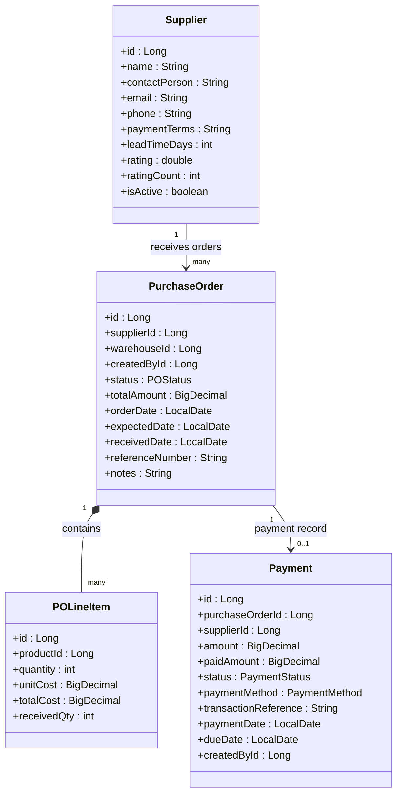
```mermaid
classDiagram
    class Supplier {
        +id : Long
        +name : String
        +contactPerson : String
        +email : String
        +phone : String
        +paymentTerms : String
        +leadTimeDays : int
        +rating : double
        +ratingCount : int
        +isActive : boolean
    }

    class PurchaseOrder {
        +id : Long
        +supplierId : Long
        +warehouseId : Long
        +createdById : Long
        +status : POStatus
        +totalAmount : BigDecimal
        +orderDate : LocalDate
        +expectedDate : LocalDate
        +receivedDate : LocalDate
        +referenceNumber : String
        +notes : String
    }

    class POLineItem {
        +id : Long
        +productId : Long
        +quantity : int
        +unitCost : BigDecimal
        +totalCost : BigDecimal
        +receivedQty : int
    }

    class Payment {
        +id : Long
        +purchaseOrderId : Long
        +supplierId : Long
        +amount : BigDecimal
        +paidAmount : BigDecimal
        +status : PaymentStatus
        +paymentMethod : PaymentMethod
        +transactionReference : String
        +paymentDate : LocalDate
        +dueDate : LocalDate
        +createdById : Long
    }

    Supplier "1" --> "many" PurchaseOrder : receives orders
    PurchaseOrder "1" *-- "many" POLineItem : contains
    PurchaseOrder "1" --> "0..1" Payment : payment record
```

### 15.4 Movement, Alert, and Reporting Database Entities

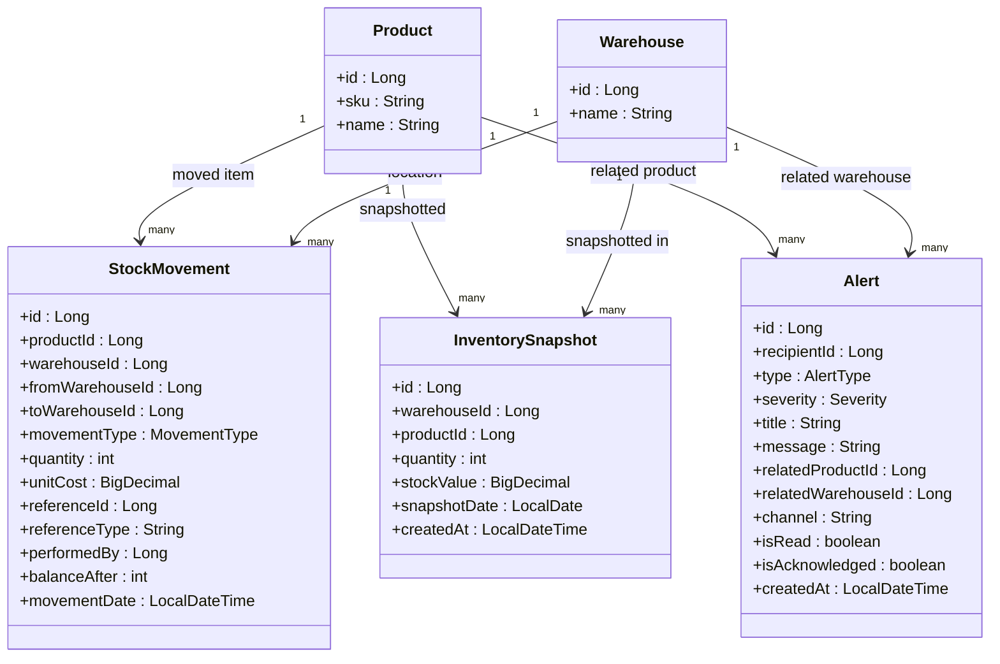
```mermaid
classDiagram
    class StockMovement {
        +id : Long
        +productId : Long
        +warehouseId : Long
        +fromWarehouseId : Long
        +toWarehouseId : Long
        +movementType : MovementType
        +quantity : int
        +unitCost : BigDecimal
        +referenceId : Long
        +referenceType : String
        +performedBy : Long
        +balanceAfter : int
        +movementDate : LocalDateTime
    }

    class Alert {
        +id : Long
        +recipientId : Long
        +type : AlertType
        +severity : Severity
        +title : String
        +message : String
        +relatedProductId : Long
        +relatedWarehouseId : Long
        +channel : String
        +isRead : boolean
        +isAcknowledged : boolean
        +createdAt : LocalDateTime
    }

    class InventorySnapshot {
        +id : Long
        +warehouseId : Long
        +productId : Long
        +quantity : int
        +stockValue : BigDecimal
        +snapshotDate : LocalDate
        +createdAt : LocalDateTime
    }

    class Product {
        +id : Long
        +sku : String
        +name : String
    }

    class Warehouse {
        +id : Long
        +name : String
    }

    Product "1" --> "many" StockMovement : moved item
    Warehouse "1" --> "many" StockMovement : location
    Product "1" --> "many" InventorySnapshot : snapshotted
    Warehouse "1" --> "many" InventorySnapshot : snapshotted in
    Product "1" --> "many" Alert : related product
    Warehouse "1" --> "many" Alert : related warehouse
```

## 16. Sequence Diagrams

### 16.1 User Login Flow

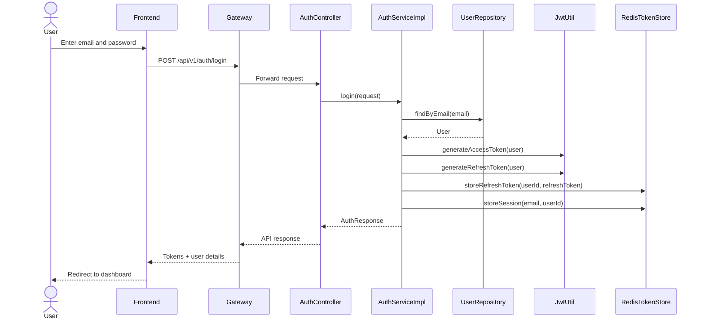
```mermaid
sequenceDiagram
    actor User
    participant Frontend
    participant Gateway
    participant AuthController
    participant AuthServiceImpl
    participant UserRepository
    participant JwtUtil
    participant RedisTokenStore

    User->>Frontend: Enter email and password
    Frontend->>Gateway: POST /api/v1/auth/login
    Gateway->>AuthController: Forward request
    AuthController->>AuthServiceImpl: login(request)
    AuthServiceImpl->>UserRepository: findByEmail(email)
    UserRepository-->>AuthServiceImpl: User
    AuthServiceImpl->>JwtUtil: generateAccessToken(user)
    AuthServiceImpl->>JwtUtil: generateRefreshToken(user)
    AuthServiceImpl->>RedisTokenStore: storeRefreshToken(userId, refreshToken)
    AuthServiceImpl->>RedisTokenStore: storeSession(email, userId)
    AuthServiceImpl-->>AuthController: AuthResponse
    AuthController-->>Gateway: API response
    Gateway-->>Frontend: Tokens + user details
    Frontend-->>User: Redirect to dashboard
```

### 16.2 Purchase Order Approval Flow

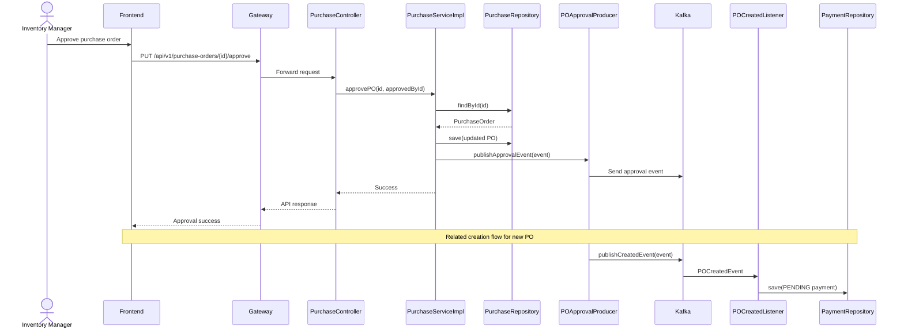
```mermaid
sequenceDiagram
    actor Manager as Inventory Manager
    participant Frontend
    participant Gateway
    participant PurchaseController
    participant PurchaseServiceImpl
    participant PurchaseRepository
    participant POApprovalProducer
    participant Kafka
    participant PaymentListener as POCreatedListener
    participant PaymentRepository

    Manager->>Frontend: Approve purchase order
    Frontend->>Gateway: PUT /api/v1/purchase-orders/{id}/approve
    Gateway->>PurchaseController: Forward request
    PurchaseController->>PurchaseServiceImpl: approvePO(id, approvedById)
    PurchaseServiceImpl->>PurchaseRepository: findById(id)
    PurchaseRepository-->>PurchaseServiceImpl: PurchaseOrder
    PurchaseServiceImpl->>PurchaseRepository: save(updated PO)
    PurchaseServiceImpl->>POApprovalProducer: publishApprovalEvent(event)
    POApprovalProducer->>Kafka: Send approval event
    PurchaseServiceImpl-->>PurchaseController: Success
    PurchaseController-->>Gateway: API response
    Gateway-->>Frontend: Approval success

    Note over Frontend,PaymentRepository: Related creation flow for new PO
    POApprovalProducer->>Kafka: publishCreatedEvent(event)
    Kafka->>PaymentListener: POCreatedEvent
    PaymentListener->>PaymentRepository: save(PENDING payment)
```

### 16.3 Goods Receipt and Stock Update Flow

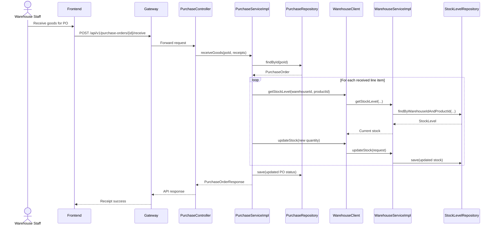
```mermaid
sequenceDiagram
    actor Staff as Warehouse Staff
    participant Frontend
    participant Gateway
    participant PurchaseController
    participant PurchaseServiceImpl
    participant PurchaseRepository
    participant WarehouseClient
    participant WarehouseServiceImpl
    participant StockLevelRepository

    Staff->>Frontend: Receive goods for PO
    Frontend->>Gateway: POST /api/v1/purchase-orders/{id}/receive
    Gateway->>PurchaseController: Forward request
    PurchaseController->>PurchaseServiceImpl: receiveGoods(poId, receipts)
    PurchaseServiceImpl->>PurchaseRepository: findById(poId)
    PurchaseRepository-->>PurchaseServiceImpl: PurchaseOrder

    loop For each received line item
        PurchaseServiceImpl->>WarehouseClient: getStockLevel(warehouseId, productId)
        WarehouseClient->>WarehouseServiceImpl: getStockLevel(...)
        WarehouseServiceImpl->>StockLevelRepository: findByWarehouseIdAndProductId(...)
        StockLevelRepository-->>WarehouseServiceImpl: StockLevel
        WarehouseServiceImpl-->>WarehouseClient: Current stock

        PurchaseServiceImpl->>WarehouseClient: updateStock(new quantity)
        WarehouseClient->>WarehouseServiceImpl: updateStock(request)
        WarehouseServiceImpl->>StockLevelRepository: save(updated stock)
    end

    PurchaseServiceImpl->>PurchaseRepository: save(updated PO status)
    PurchaseServiceImpl-->>PurchaseController: PurchaseOrderResponse
    PurchaseController-->>Gateway: API response
    Gateway-->>Frontend: Receipt success
```

## Notes

- This version includes the whole project and each microservice separately.
- It is split into multiple smaller diagrams so Mermaid preview stays readable.
- If you want, I can make one more version next that is:
  - more academic and formal for submission
  - color-grouped by service
  - exported into PlantUML format
